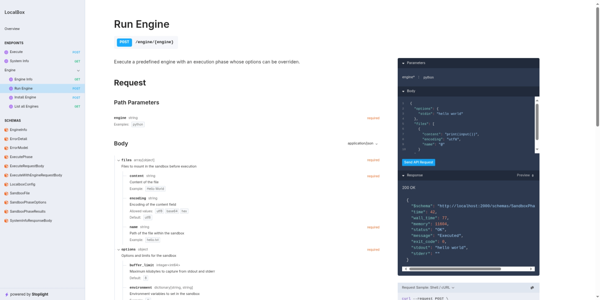

<div>
  <h1 style="text-align:center">LocalBox</h1>
  <p style="text-align:center">An <b>easy-to-host</b>, <b>general purpose</b> and <b>fast</b> code execution system for running <b>untrusted</b> code in sandboxes.</p>
</div>

## Why?

[Piston](https://github.com/engineer-man/piston) and [Judge0](https://github.com/judge0/judge0) are already well established and tested code execution systems, so why the need to reinvent the wheel?

Both of these projects have some *issues* which did not fit my usecase, namely:

1. In both Piston and Judge0
    - You cannot install the latest versions of compilers and runtimes, you are only limited to the versions which the creators bothered to add and update.
    - Very difficult to run arbitrary commands for specific usecases.
2. In Piston
    - Isolate doesn't share cgroups with host system which can lead to inaccurate program limits and runtime metrics.
    - All programs are run in bash which adds additional overhead to measuring program runtime metrics.
    - You have to compile/build the runtime on your system for many languages instead of getting prebuilt binaries.
3. In Judge0
    - Only supports outdated linux cgroups v1, you will have to change kernel options in any machine with a recent linux kernel.
    - Cannot take multiple files as input.

## Getting Started

### With Docker

The image exposes port 2000 by default, the `--privileged --cgroupns=host` are important as they allow localbox to manipulate cgroups.

```sh
docker run --rm -it --privileged --cgroupns=host -p 2000:2000 ghcr.io/thecomputerm/localbox:latest
```

## Usage

You can visit http://localhost:2000/docs to get the full API documentation.



Here are the options you can provide the sandbox with to configure it:

```go
type SandboxPhaseOptions struct {
	MemoryLimit  int               `json:"memory_limit,omitempty" doc:"Maximum total memory usage allowed by the whole control group in KB, '-1' for no limit" default:"-1"`
	TimeLimit    int               `json:"time_limit,omitempty" doc:"Maximum CPU time of the program in milliseconds, '-1' for no limit" default:"5000"`
	FilesLimit   int               `json:"files_limit,omitempty" doc:"Maximum number of open files allowed in the sandbox, '-1' for no limit" default:"64"`
	ProcessLimit int               `json:"process_limit,omitempty" doc:"Maximum number of processes allowed in the sandbox" default:"64"`
	Network      bool              `json:"network,omitempty" doc:"Whether to enable network access in the sandbox" default:"false"`
	Stdin        string            `json:"stdin,omitempty" doc:"Text to pass into stdin of the program" default:""`
	BufferLimit  int               `json:"buffer_limit,omitempty" doc:"Maximum kilobytes to capture from stdout and stderr" default:"8"`
	Environment  map[string]string `json:"environment,omitempty" doc:"Environment variables to set in the sandbox" example:"{}"`
}
```

And here are the options you have to define to mount files in the sandbox

```go
type SandboxFile struct {
	Name     string `json:"name" doc:"Path of the file within the sandbox" example:"hello.txt"`
	Content  string `json:"content" doc:"Content of the file" example:"Hello World"`
	Encoding string `json:"encoding,omitempty" doc:"Encoding of the content field" enum:"utf8,base64,hex" default:"utf8" `
}
```

### Using an Engine

`GET /engine`: List all the available engines.

Here is a [list of available languages/runtimes](./engines/) packaged as engines, these provide preconfigured compile and execute steps so you don't have to set stuff up.

`POST /engine/{engine_name}/execute`: Execute a predefined engine with an execution phase whose options can be overridden.

```jsonc
// Request Body
{
  "options": {
    "stdin": "hello world"
  },
  "files": [
    {
      "content": "print(input())",
      "encoding": "utf8",
      "name": "@" // use "@" to denote that this file is the main executable for the engine
    }
  ]
}

// Response
{
  "$schema": "http://localhost:9000/schemas/SandboxPhaseResults.json",
  "time": 20,
  "wall_time": 42,
  "memory": 4076,
  "status": "OK",
  "message": "Executed",
  "exit_code": 0,
  "stdout": "hello world",
  "stderr": ""
}
```

### Custom workflow

Instead of using a predefined engine, you can go the full custom route by specifying your own packages, commands and options for each phase.

```go
type SandboxPhase struct {
	Command   string   `json:"command" doc:"Command to execute in the sandbox" example:"cat hello.txt"`
	SkipShell bool     `json:"skip_shell,omitempty" doc:"Doesn't use a shell to run the command to if true, can be used to get more accurate results" default:"false"`
	Packages  []string `json:"packages,omitempty" doc:"Nix packages to install in the sandbox" example:"nixpkgs#cowsay,nixpkgs/nixos-25.05#busybox"`
}
```

`POST /execute`: Execute a series of phases, where each of them can have different options, packages and commands with persistent files.

```jsonc
// Request Body
{
  "files": [
    {
      "content": "Hello World",
      "encoding": "utf8",
      "name": "hello.txt"
    }
  ],
  "phases": [
    {
      "buffer_limit": 8,
      "command": "cat hello.txt",
      "environment": {},
      "files_limit": 64,
      "memory_limit": -1,
      "network": false,
      "packages": [
        "nixpkgs#cowsay",
        "nixpkgs/nixos-25.05#busybox"
      ],
      "process_limit": 64,
      "skip_shell": false,
      "stdin": "string",
      "time_limit": 5000
    }
  ]
}

// Response Body
[
  {
    "time": 4,
    "wall_time": 14,
    "memory": 500,
    "status": "OK",
    "message": "Executed",
    "exit_code": 0,
    "stdout": "Hello World",
    "stderr": ""
  }
]
```

## Security

As both localbox and piston use isolate, they both make use of Linux namespaces, chroot, multiple unprivileged users, and cgroup for sandboxing and resource limiting; thereby providing [similar battle-tested security](https://github.com/engineer-man/piston/tree/master?tab=readme-ov-file#security).
